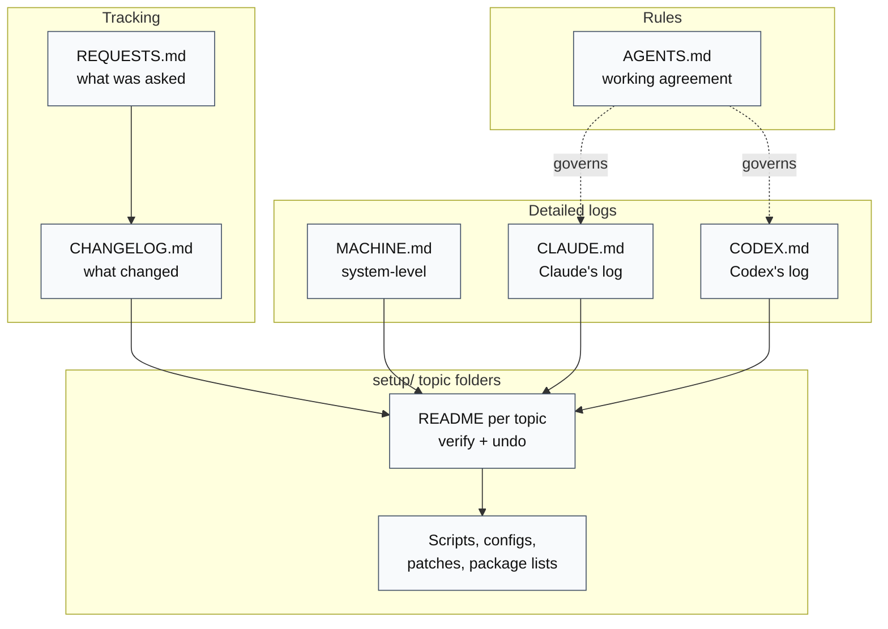
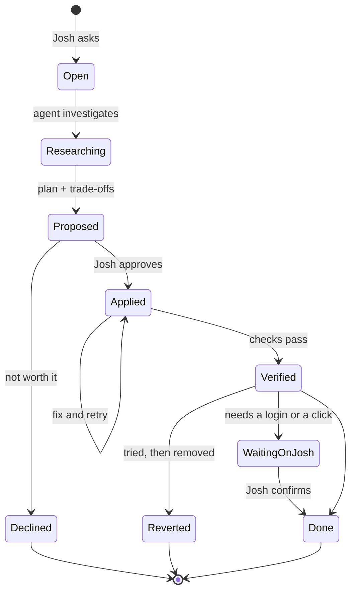
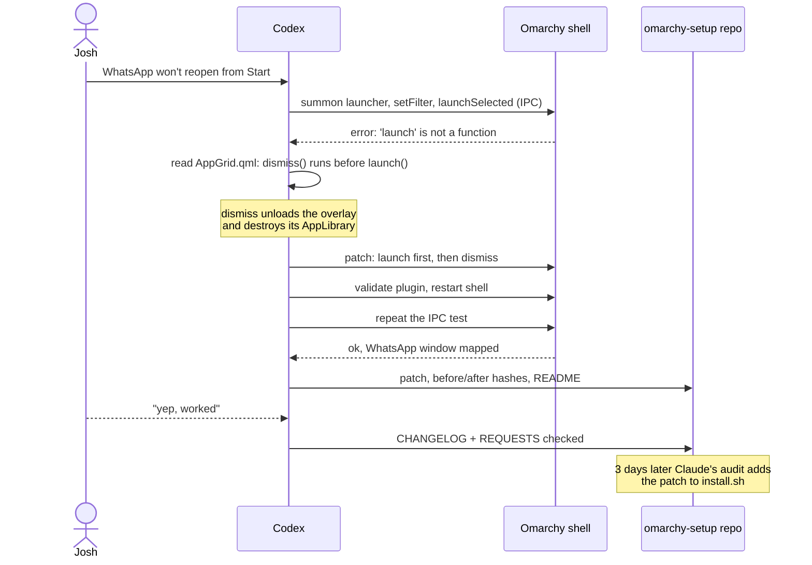
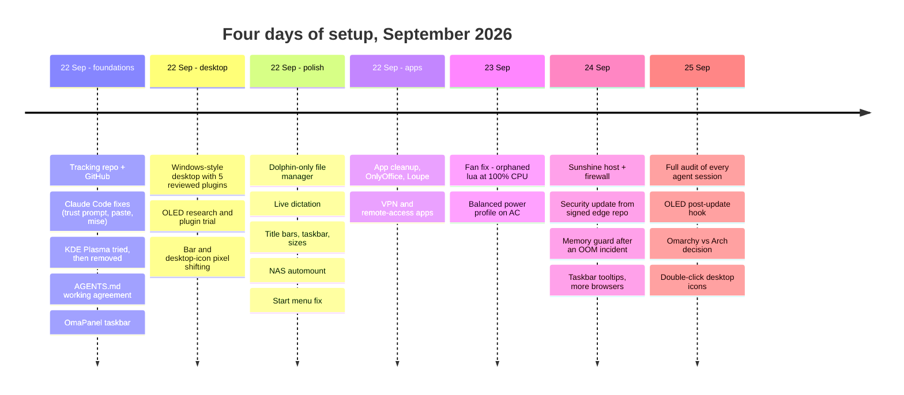
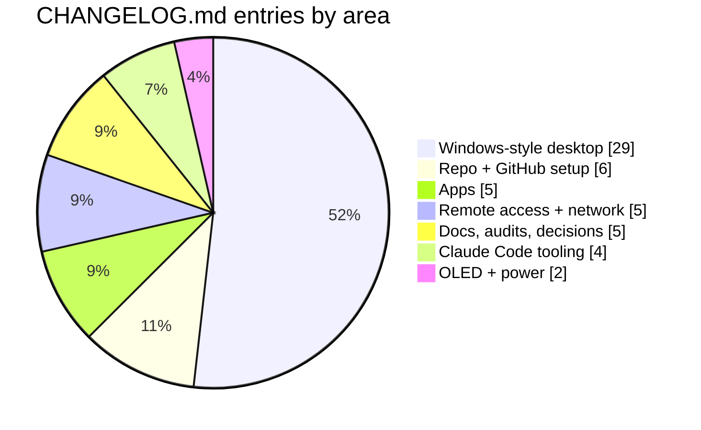
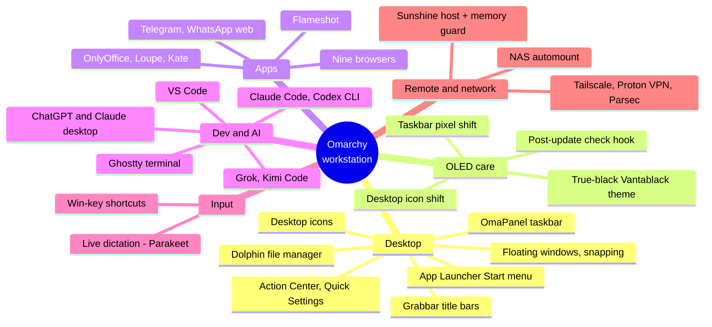
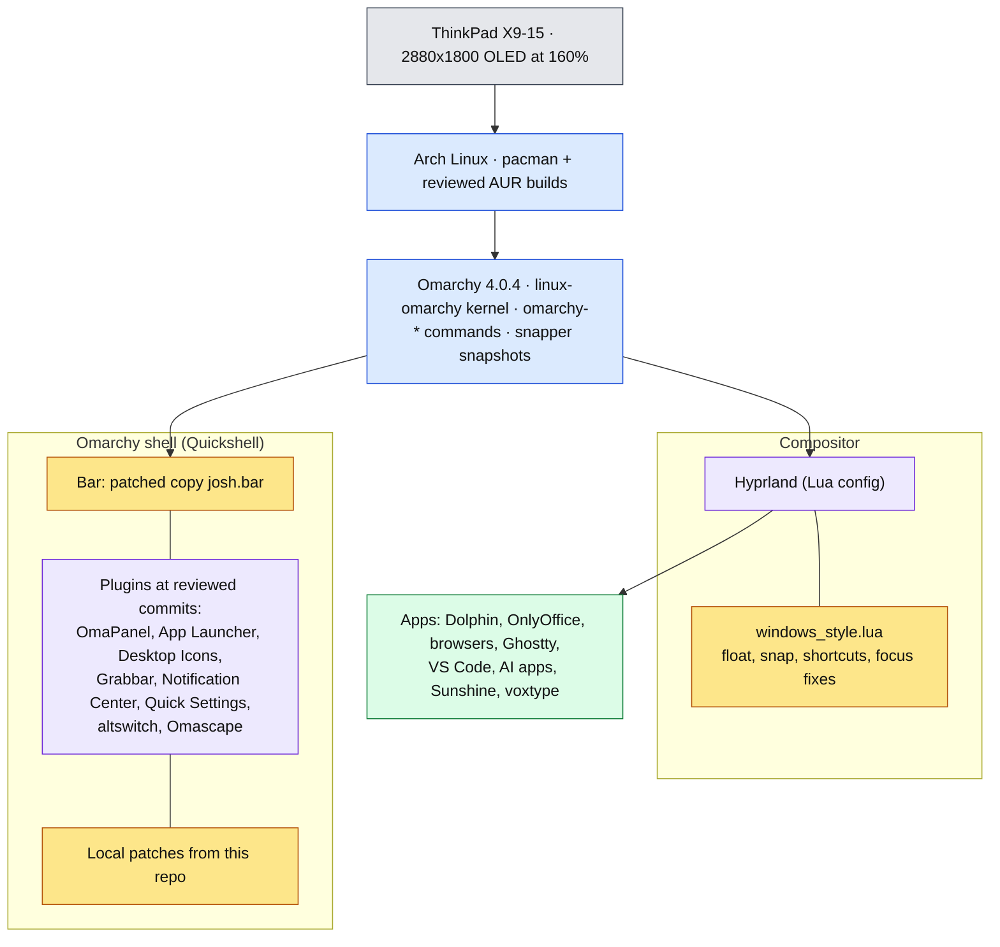
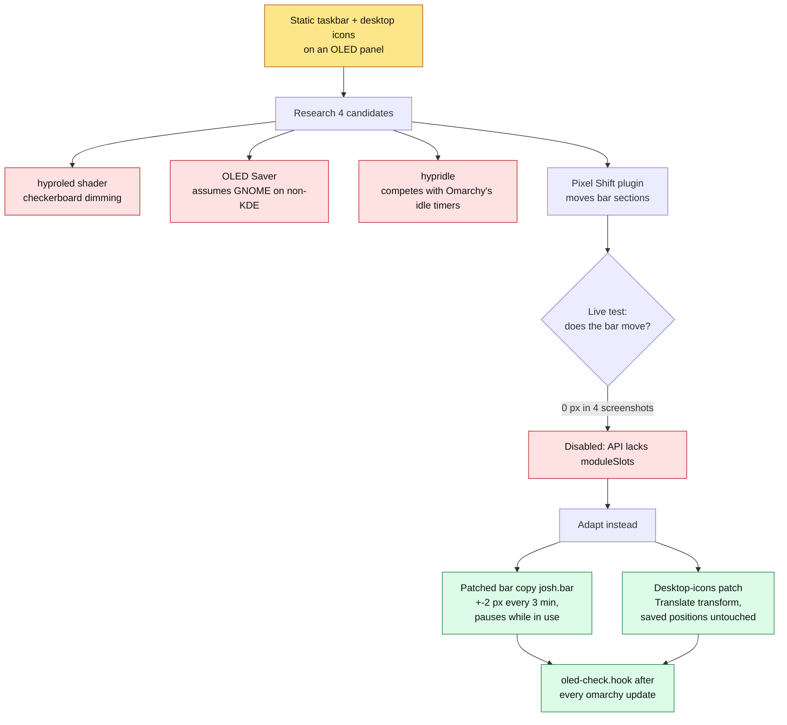
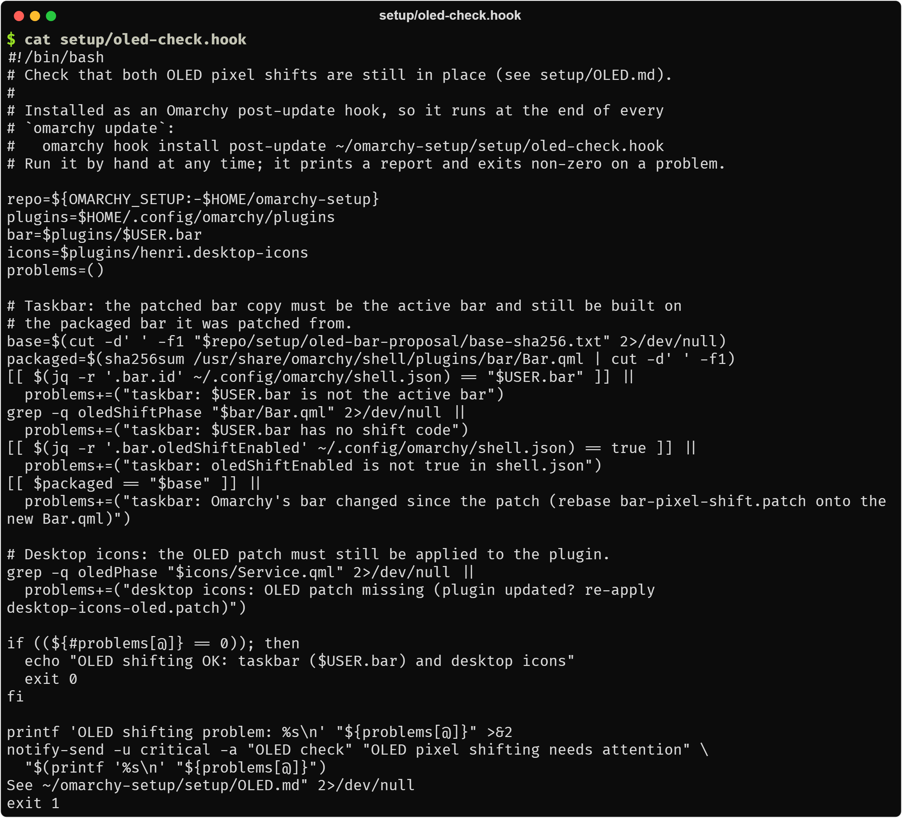
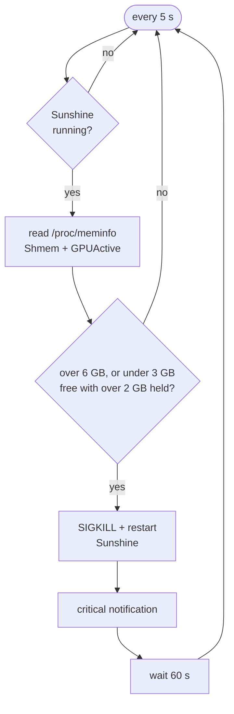

# Omarchy setup

**A reproducible, fully documented Omarchy workstation, built by directing AI
coding agents (Claude Code and Codex), with a change log and an audit trail
of every decision.**

[](https://archlinux.org/)
[](https://omarchy.org/)
[](https://hypr.land/)
[](#how-the-agent-workflow-works)
[](LICENSE)

This repository records how a 13" OLED laptop running
[Omarchy](https://omarchy.org/) (Arch Linux + Hyprland) was turned into a
daily workstation over four days in September 2026. Josh described what he
wanted; the agents investigated, proposed, applied changes once he approved
them, verified them, and wrote everything down (including the one install
that went ahead too early, and its removal): the commands, the configuration
files, the patches to upstream plugins, the failed attempts, and how to undo
each step.

The result is a Windows-style desktop (floating windows, a taskbar with
previews, a Start menu, desktop icons, title bars with minimize and maximize)
that runs inside Omarchy's own shell. On top of that come OLED burn-in
mitigation, live dictation, a remote-desktop host, and some thirty apps and
tools.
Every change is traceable from request to change-log entry.

## Contents

- [What's in here](#whats-in-here)
- [How the agent workflow works](#how-the-agent-workflow-works)
- [One change, end to end](#one-change-end-to-end)
- [Timeline](#timeline)
- [The workstation stack](#the-workstation-stack)
- [Highlights](#highlights)
- [Repository layout](#repository-layout)
- [How to reuse this](#how-to-reuse-this)
- [License](#license)

## What's in here

### Top-level records

| File | What it holds |
| --- | --- |
| [AGENTS.md](AGENTS.md) | The working agreement every agent follows: discuss first, ask before installing, record everything |
| [REQUESTS.md](REQUESTS.md) | Every request and its status (checked = done, unchecked = open) |
| [CHANGELOG.md](CHANGELOG.md) | Dated summary of every completed change, newest first |
| [MACHINE.md](MACHINE.md) | Machine-level changes: packages, system files, services, repeat procedure |
| [CLAUDE.md](CLAUDE.md) | Claude Code's own setup, its work log, and lessons for future sessions |
| [CODEX.md](CODEX.md) | Codex's requests, actions, and troubleshooting |

### `setup/`: configs, scripts, patches, and topic notes

| Folder / file | What it covers |
| --- | --- |
| [windows-style/](setup/windows-style/README.md) | The Windows-style desktop: Hyprland Lua config, reviewed plugins, nine local patches, `install.sh`, and topic docs (taskbar, appearance, dictation, file manager, NAS, troubleshooting) |
| [OLED.md](setup/OLED.md) | Index and log of the OLED burn-in protection, plus its post-update check |
| [OLED-RESEARCH.md](setup/OLED-RESEARCH.md), [OLED-PIXEL-SHIFT-TRIAL.md](setup/OLED-PIXEL-SHIFT-TRIAL.md) | Options researched, and the community plugin that silently didn't work |
| [oled-bar-proposal/](setup/oled-bar-proposal/README.md) | Patch that makes a copy of Omarchy's bar shift its contents every three minutes |
| [oled-desktop-icons/](setup/oled-desktop-icons/README.md) | Patch that shifts desktop icons without moving their saved positions |
| [oled-check.hook](setup/oled-check.hook) | Post-update hook that warns when an Omarchy update breaks either shift |
| [DECISION-OMARCHY-VS-ARCH.md](setup/DECISION-OMARCHY-VS-ARCH.md) | Why this machine stays on Omarchy instead of plain Arch, and how update risk is managed |
| [OMARCHY-PLUGINS.md](setup/OMARCHY-PLUGINS.md) | First survey of taskbar, dock, and icon plugins |
| [omapanel/](setup/omapanel/README.md) | The OmaPanel taskbar: settings and a replay script |
| [start-menu-launch-fix/](setup/start-menu-launch-fix/README.md) | Fix for Start-menu apps that never opened (launch before dismiss) |
| [sunshine/](setup/sunshine/README.md) | Sunshine remote-desktop host: firewall rules, security update, memory-leak incident, memory guard |
| [apps/](setup/apps/README.md) | Every app added or removed, with a reviewed AUR PKGBUILD |
| [browsers/](setup/browsers/README.md) | Extra browsers and taskbar pins |
| [desktop-apps/](setup/desktop-apps/README.md) | VS Code, ChatGPT with Codex, Claude Desktop |
| [ai-clis/](setup/ai-clis/grok-kimi.md) | Grok and Kimi Code CLIs |
| [ghostty/](setup/ghostty/README.md) | Ghostty terminal: visible tabs, Windows Terminal styling, Campbell colours |
| [claude/](setup/claude/statusline.sh) | Claude Code status line and a virtual-mouse test helper |
| [network-apps/](setup/network-apps/README.md) | Proton VPN, Tailscale, and Parsec |
| [messaging/](setup/messaging/README.md) | Telegram and the WhatsApp web app |
| [plasma/](setup/plasma/README.md) | The KDE Plasma attempt, kept for the record after it was uninstalled |

## How the agent workflow works

Two agents worked on the same machine, often at the same time. Codex set up
the tracking repository, the taskbar, the OLED shifting, and many app
installs. Claude Code built most of the Windows-style desktop, the Sunshine
host, and the later audits. A short working agreement in
[AGENTS.md](AGENTS.md) governs both: investigate freely, but discuss any
machine change with Josh and wait for explicit approval, especially before
installing anything.


Each record has one job, and they link to each other rather than repeat.



A request moves through these states in [REQUESTS.md](REQUESTS.md). Not
everything ends in "done": several ideas were tried and removed, or declined
after research, and the reason is kept.



Examples of each ending: the Fluent GTK theme and the Selawik font were
applied and later **reverted** (not noticeable; colour fringing on the
OLED); KDE Open/Save dialogs and a tray-overflow plugin were **declined**
after research (57 Plasma packages; unsupported internals); the Start-menu
fix was **done** once Josh confirmed it. At the time of writing, 60 items are
checked and 7 are open.

## One change, end to end

The Start-menu bug, from [start-menu-launch-fix/](setup/start-menu-launch-fix/README.md):
WhatsApp opened when launched directly but never from the Start menu.



## Timeline

Dates are from [CHANGELOG.md](CHANGELOG.md) and the topic logs.



What the 56 change-log entries were about (grouped by hand from
[CHANGELOG.md](CHANGELOG.md); the OLED work was logged as part of one
consolidated Codex entry, so it counts for less here than it weighed):



## The workstation stack



How the pieces sit on each other. Most of the desktop is plugins for
Omarchy's shell, which is why the [decision note](setup/DECISION-OMARCHY-VS-ARCH.md)
concluded that "plain Arch" would mean rebuilding Omarchy.



Yellow boxes are the parts this repo owns. Every local change to someone
else's code is a patch file here, applied on top of a pinned upstream commit.

## Highlights

The more interesting problems, each with a link to its full write-up.

### OLED burn-in: when the obvious plugin silently does nothing

The taskbar and desktop icons never move, which is the worst case for an OLED
panel. The research compared four options; the best-matched community plugin
loaded, passed its own tests, and moved nothing. The cause: Omarchy's
restricted plugin API doesn't expose the `moduleSlots` property the plugin
relies on, so it returns without an error.



Movement was measured, not assumed: the clock stepped 1679 → 1681 → 1683 px
in the running bar, and the desktop-position file kept the same SHA-256 while
icons moved. The hook compares the packaged `Bar.qml` with the hash the patch
was made against, so an Omarchy update that changes the bar raises a
notification instead of silently dropping the protection.
[OLED.md](setup/OLED.md) ·
[research](setup/OLED-RESEARCH.md) ·
[trial](setup/OLED-PIXEL-SHIFT-TRIAL.md)



### A fan that never stopped

The fan ran constantly. An orphaned `lua` process had been at 100% CPU for
19 hours, holding the package at 86 °C. Omarchy's keybindings menu (Win+K)
evaluates `hyprland.lua` in a stub environment where every `hl.*` call
returns a placeholder, so an `ipairs()` loop over `hl.get_loaded_plugins()`
in `windows_style.lua` never ended. The loop is now counted, the process was
killed (about 45 °C afterwards), and the on-charger power profile moved from
Performance to Balanced.
[MACHINE.md](MACHINE.md#2026-09-23--omarchy--quieter-fan-balanced-on-ac-claude) ·
[WINDOWS-AND-SHORTCUTS.md](setup/windows-style/WINDOWS-AND-SHORTCUTS.md#keep-this-file-safe-for-omarchys-keybindings-menu)

### The hollow cursor: four causes of lost keyboard focus

Typing would stop in a window that still looked focused. A Hyprland event
logger showed four separate causes: invisible shell panels opened by
another agent's tests, click-to-focus not returning the keyboard after a
pop-up closed, the screensaver dismissal landing on the desktop layer, and
the desktop-icons layer grabbing the keyboard on every wallpaper click. The
fixes are a delayed re-focus handler, a screensaver launcher that restores
the previous window, and a plugin patch; a 15-round test delivered every
typed marker. [TROUBLESHOOTING.md](setup/windows-style/TROUBLESHOOTING.md)

### A remote-desktop host that ate all memory

Sunshine was left streaming on the lock screen. Graphics buffers grew by
about one 2880×1800 frame per second until the kernel OOM killer took five
apps. No process's memory accounted for it; the kernel's `shmem` and
`gpu_active` counters did. A small user service now restarts Sunshine when
those buffers pass 6 GB. The same day, a Sunshine security advisory was
fixed by installing the signed build from Omarchy's edge repo, after
checking its signature and hash.



[sunshine/README.md](setup/sunshine/README.md) ·
[sunshine-memguard.sh](setup/sunshine/sunshine-memguard.sh)

### More

- **Start menu with empty grid, then apps that never launched:** Omarchy
  4.0.4 only hands its app library to one kind of plugin, so the launcher now
  falls back to its own instance; separately, `dismiss()` destroyed that
  instance before `launch()` ran. [PLUGINS.md](setup/windows-style/PLUGINS.md#start-menu-with-coloured-icons) ·
  [fix](setup/start-menu-launch-fix/README.md)
- **Windows-style maximize:** Hyprland draws maximized windows beneath
  floating ones, so maximize is rewritten as a floating window filling the
  work area. [WINDOWS-AND-SHORTCUTS.md](setup/windows-style/WINDOWS-AND-SHORTCUTS.md#window-behaviour)
- **Slow NAS browsing:** each `.local` lookup waited 5 s for an IPv6 mDNS
  answer; `mdns4_minimal` brought it to 0.07 s, and kernel CIFS automounts
  replaced Dolphin's user-space SMB client. [NAS.md](setup/windows-style/NAS.md)
- **Live dictation:** voxtype switched to streaming Parakeet; the daemon
  crash-looped until the context windows were set to multiples of 0.08 s,
  values found in the error text and the binary, not the docs.
  [DICTATION.md](setup/windows-style/DICTATION.md)
- **Supply-chain care:** every shell plugin's source was read before
  install and pinned to the reviewed commit in
  [plugins.txt](setup/windows-style/plugins.txt); AUR PKGBUILDs were read
  and built as the user; release signatures were checked. Trade-offs that
  loosen security (agents running without approval prompts, mise's
  release-age delay turned off) are recorded as deliberate, with undo steps.
- **The audit:** on the last day Claude compared every Claude and Codex
  session with the repo, found two undocumented Codex changes (now
  recorded) and a repeat script that skipped the OLED and Start-menu
  patches (now fixed).
  [CHANGELOG.md](CHANGELOG.md)

## Repository layout

```text
omarchy-setup/
├── AGENTS.md            working agreement for all agents
├── REQUESTS.md          requests and their status
├── CHANGELOG.md         dated summary of every change
├── MACHINE.md           machine-level changes + repeat procedure
├── CLAUDE.md            Claude Code log
├── CODEX.md             Codex log
├── docs/images/         image used in this README
└── setup/
    ├── windows-style/   desktop: windows_style.lua, install.sh, patches, topic docs
    │   ├── colors/ dictation/ dolphin/ flameshot/ screensaver/ theme-overlay/ apps/
    ├── OLED.md  OLED-RESEARCH.md  OLED-PIXEL-SHIFT-TRIAL.md  oled-check.hook
    ├── oled-bar-proposal/     bar-pixel-shift.patch + base hash
    ├── oled-desktop-icons/    desktop-icons-oled.patch + verification
    ├── start-menu-launch-fix/ launch-before-dismiss.patch
    ├── omapanel/        taskbar settings + configure.py
    ├── sunshine/        memory guard, firewall rules, leak test
    ├── apps/  browsers/  desktop-apps/  ai-clis/  messaging/  network-apps/
    ├── ghostty/  claude/
    ├── plasma/          the abandoned Plasma route, for the record
    └── DECISION-OMARCHY-VS-ARCH.md  OMARCHY-PLUGINS.md
```

## How to reuse this

This is a record of one machine, not a one-command installer. The repeat
steps have not yet been run on a second machine.

1. Start with the repeat procedure in [MACHINE.md](MACHINE.md#repeat-on-another-machine)
   and the per-topic "Repeat" sections; each topic README lists
   prerequisites, verification, and undo.
2. For the desktop, read [windows-style/README.md](setup/windows-style/README.md),
   then run [`setup/windows-style/install.sh`](setup/windows-style/install.sh).
   It checks plugins out at the reviewed commits, applies the local patches in
   order, and backs up each file it changes. It only patches the bar when
   the machine's `Bar.qml` matches the recorded hash.
3. Install the OLED check as a post-update hook:
   `omarchy hook install post-update ~/omarchy-setup/setup/oled-check.hook`.
4. Take the pieces you want: the Hyprland config
   ([windows_style.lua](setup/windows-style/windows_style.lua)), the
   [Sunshine memory guard](setup/sunshine/sunshine-memguard.sh), the
   [Claude Code status line](setup/claude/statusline.sh), or any single patch.

The patches target Omarchy 4.0.4 and specific plugin commits; on newer
versions, expect to rebase them.

## License

Copyright (c) 2026 Josh Simerman. Licensed under the GNU Affero General
Public License v3.0 or later. See [LICENSE](LICENSE).

Third-party files keep their original licenses and attribution. This
includes the AUR [`onlyoffice-bin.PKGBUILD`](setup/apps/onlyoffice-bin.PKGBUILD),
the screensaver launcher adapted from jkwuc89's MIT-licensed original
([LICENSE.jkwuc89](setup/windows-style/screensaver/LICENSE.jkwuc89)), the
voxtype configuration based on voxtype's default file, the Campbell colour
values from Microsoft's Windows Terminal, and the `.patch` files, which modify
upstream Omarchy plugins under those projects' licenses.
