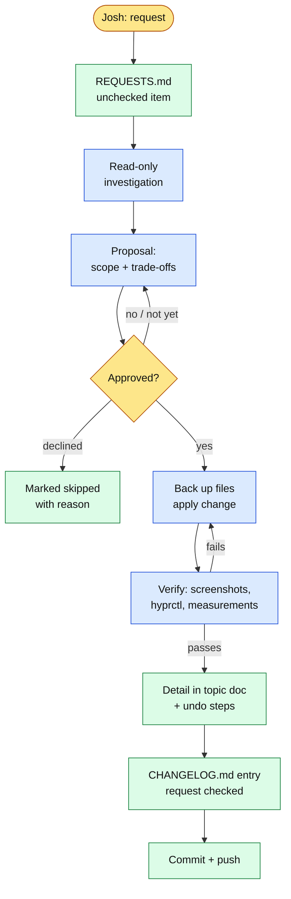
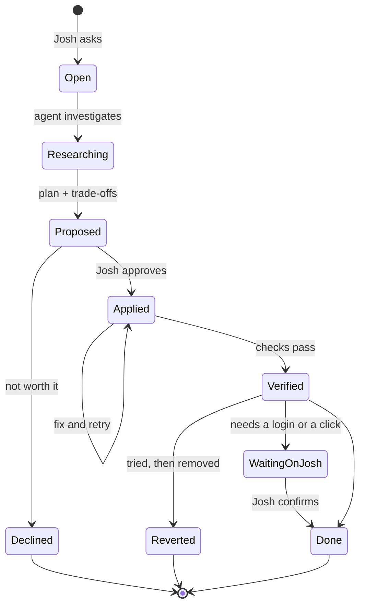
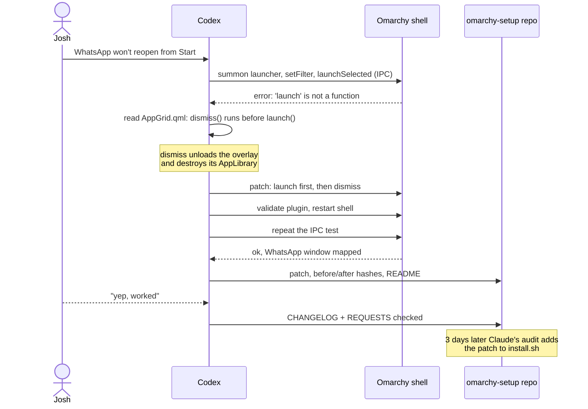
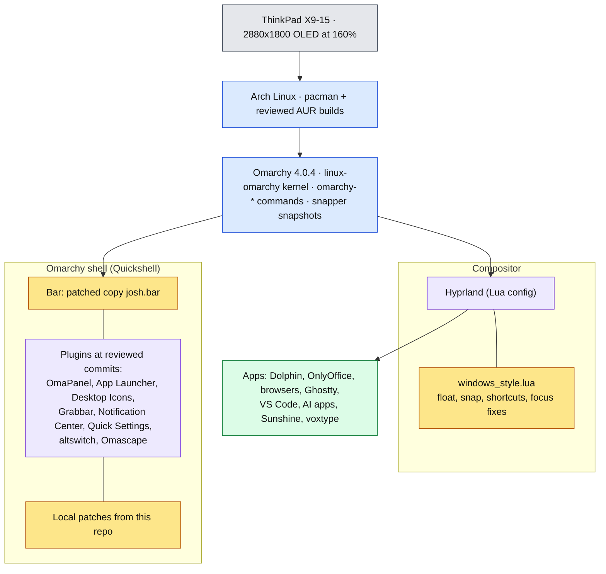

# Omarchy setup

**A reproducible, fully documented Omarchy workstation, built by directing AI
coding agents (Claude Code and Codex), with a change log and an audit trail
of every decision.**

Over four days in September 2026, an OLED laptop running
[Omarchy](https://omarchy.org/) (Arch Linux + Hyprland) was turned into a
daily workstation by two AI coding agents working under one written
agreement. Josh described what he wanted; the agents investigated, proposed,
applied changes once he approved them, verified them, and recorded the
commands, configs, upstream patches, failed attempts, and undo steps. The
result is a Windows-style desktop running inside Omarchy's own shell, plus
OLED burn-in mitigation, live dictation, a remote-desktop host, and some
thirty apps and tools. Every change can be traced from request to
change-log entry.

The longer story (timeline, problem write-ups, extra diagrams, and the full
repository layout) is in [docs/HIGHLIGHTS.md](docs/HIGHLIGHTS.md).

## What's in here

### Top-level records

| File | What it holds |
| --- | --- |
| [AGENTS.md](AGENTS.md) | The working agreement every agent follows: discuss first, ask before installing, record everything |
| [REQUESTS.md](REQUESTS.md) | Every request and its status (checked = done, unchecked = open) |
| [CHANGELOG.md](CHANGELOG.md) | Dated summary of every completed change, newest first |
| [MACHINE.md](MACHINE.md) | Machine-level changes: packages, system files, services, repeat procedure |
| [CLAUDE.md](CLAUDE.md) | Claude Code's own setup, its work log, and lessons for future sessions |
| [CODEX.md](CODEX.md) | Codex's requests, actions, and troubleshooting |

### `setup/`: configs, scripts, patches, and topic notes

| Folder / file | What it covers |
| --- | --- |
| [windows-style/](setup/windows-style/README.md) | The Windows-style desktop: Hyprland Lua config, reviewed plugins, nine local patches, `install.sh`, and topic docs (taskbar, appearance, dictation, file manager, NAS, troubleshooting) |
| [OLED.md](setup/OLED.md) | Index and log of the OLED burn-in protection, plus its post-update check |
| [OLED-RESEARCH.md](setup/OLED-RESEARCH.md), [OLED-PIXEL-SHIFT-TRIAL.md](setup/OLED-PIXEL-SHIFT-TRIAL.md) | Options researched, and the community plugin that silently didn't work |
| [oled-bar-proposal/](setup/oled-bar-proposal/README.md) | Patch that makes a copy of Omarchy's bar shift its contents every three minutes |
| [oled-desktop-icons/](setup/oled-desktop-icons/README.md) | Patch that shifts desktop icons without moving their saved positions |
| [oled-check.hook](setup/oled-check.hook) | Post-update hook that warns when an Omarchy update breaks either shift |
| [DECISION-OMARCHY-VS-ARCH.md](setup/DECISION-OMARCHY-VS-ARCH.md) | Why this machine stays on Omarchy instead of plain Arch, and how update risk is managed |
| [OMARCHY-PLUGINS.md](setup/OMARCHY-PLUGINS.md) | First survey of taskbar, dock, and icon plugins |
| [omapanel/](setup/omapanel/README.md) | The OmaPanel taskbar: settings and a replay script |
| [start-menu-launch-fix/](setup/start-menu-launch-fix/README.md) | Fix for Start-menu apps that never opened (launch before dismiss) |
| [sunshine/](setup/sunshine/README.md) | Sunshine remote-desktop host: firewall rules, security update, memory-leak incident, memory guard |
| [apps/](setup/apps/README.md) | Every app added or removed, with a reviewed AUR PKGBUILD |
| [browsers/](setup/browsers/README.md) | Extra browsers and taskbar pins |
| [desktop-apps/](setup/desktop-apps/README.md) | VS Code, ChatGPT with Codex, Claude Desktop |
| [ai-clis/](setup/ai-clis/grok-kimi.md) | Grok and Kimi Code CLIs |
| [ghostty/](setup/ghostty/README.md) | Ghostty terminal: visible tabs, Windows Terminal styling, Campbell colours |
| [claude/](setup/claude/statusline.sh) | Claude Code status line and a virtual-mouse test helper |
| [network-apps/](setup/network-apps/README.md) | Proton VPN, Tailscale, and Parsec |
| [messaging/](setup/messaging/README.md) | Telegram and the WhatsApp web app |
| [plasma/](setup/plasma/README.md) | The KDE Plasma attempt, kept for the record after it was uninstalled |

## How the agent workflow works

Codex set up the tracking repository, the taskbar, the OLED shifting, and
many app installs; Claude Code built most of the Windows-style desktop, the
Sunshine host, and the later audits. [AGENTS.md](AGENTS.md) governs both:
investigate freely, but discuss any machine change with Josh and wait for
explicit approval, especially before installing anything.

A request moves through these states in [REQUESTS.md](REQUESTS.md). Ideas
that were tried and removed, or declined after research, keep their reason
(for example the Selawik font, reverted for colour fringing on the OLED).

### One change, end to end

The Start-menu bug ([write-up](setup/start-menu-launch-fix/README.md)):
WhatsApp opened when launched directly but never from the Start menu.

## The workstation stack

Most of the desktop is plugins for Omarchy's shell, which is why the
[decision note](setup/DECISION-OMARCHY-VS-ARCH.md) concluded that moving to
"plain Arch" would mean rebuilding Omarchy. Yellow boxes are the parts this
repo owns; every change to someone else's code is a patch file here, applied
on top of a pinned upstream commit.

## Highlights

Full write-ups, with diagrams, in [docs/HIGHLIGHTS.md](docs/HIGHLIGHTS.md#problems-solved).

- **OLED burn-in:** the best-matched community plugin loaded, passed its own
  tests, and moved nothing, because Omarchy's plugin API lacks a property it
  needs. It was replaced by a patched copy of the bar that shifts ±2 px every
  three minutes and a desktop-icons patch, with measured movement and a
  post-update hook that warns if an update breaks either. [OLED.md](setup/OLED.md)
- **A fan that never stopped:** an orphaned `lua` at 100% CPU for 19 hours,
  caused by an `ipairs()` loop that never ends in the stub environment of
  Omarchy's keybindings menu. [MACHINE.md](MACHINE.md#2026-09-23--omarchy--quieter-fan-balanced-on-ac-claude)
- **Lost keyboard focus:** four separate causes found with a Hyprland event
  logger, each fixed and tested. [TROUBLESHOOTING.md](setup/windows-style/TROUBLESHOOTING.md)
- **A remote-desktop host that ate all memory:** leaked graphics buffers
  traced through kernel counters, then contained by a small memory-guard
  service. [sunshine/](setup/sunshine/README.md)
- **Supply-chain care:** every shell plugin's source read before install and
  pinned to the reviewed commit; AUR PKGBUILDs read and built as the user;
  signatures checked; security trade-offs recorded as deliberate, with undo.

## How to reuse this

This is a record of one machine, not a one-command installer. The repeat
steps have not yet been run on a second machine.

1. Start with the repeat procedure in [MACHINE.md](MACHINE.md#repeat-on-another-machine)
   and the per-topic "Repeat" sections; each topic README lists
   prerequisites, verification, and undo.
2. For the desktop, read [windows-style/README.md](setup/windows-style/README.md),
   then run [`setup/windows-style/install.sh`](setup/windows-style/install.sh).
   It checks plugins out at the reviewed commits, applies the local patches in
   order, and backs up each home-directory file before changing it. It is
   safe to run again: every step checks the current state first, so a second
   run changes nothing. It only patches the bar when the machine's `Bar.qml`
   matches the recorded hash.
3. Install the OLED check as a post-update hook:
   `omarchy hook install post-update ~/omarchy-setup/setup/oled-check.hook`.
4. Take the pieces you want: the Hyprland config
   ([windows_style.lua](setup/windows-style/windows_style.lua)), the
   [Sunshine memory guard](setup/sunshine/sunshine-memguard.sh), the
   [Claude Code status line](setup/claude/statusline.sh), or any single patch.

The patches target Omarchy 4.0.4 and specific plugin commits; on newer
versions, expect to rebase them.

## About this repository

This is a v1 snapshot exported from a private repository. Its history was
squashed into a single initial commit, so there is no earlier history to
browse here.

## License

Copyright (c) 2026 Josh Simerman. Licensed under the GNU Affero General
Public License v3.0 or later. See [LICENSE](LICENSE).

Third-party files keep their original licenses and attribution. This
includes the AUR [`onlyoffice-bin.PKGBUILD`](setup/apps/onlyoffice-bin.PKGBUILD),
the screensaver launcher adapted from jkwuc89's MIT-licensed original
([LICENSE.jkwuc89](setup/windows-style/screensaver/LICENSE.jkwuc89)), the
voxtype configuration based on voxtype's default file, the Campbell colour
values from Microsoft's Windows Terminal, and the `.patch` files, which modify
upstream Omarchy plugins under those projects' licenses.
