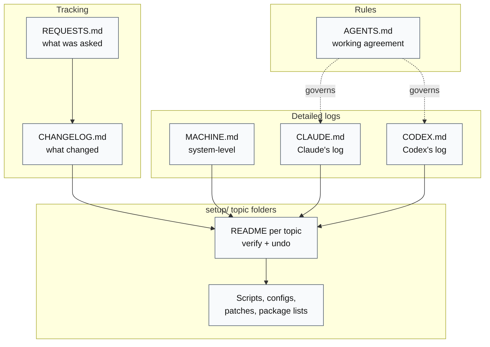
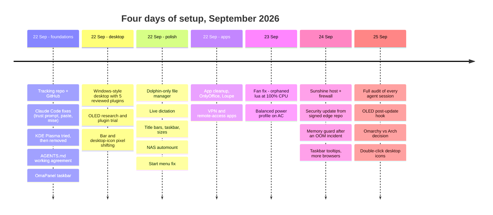
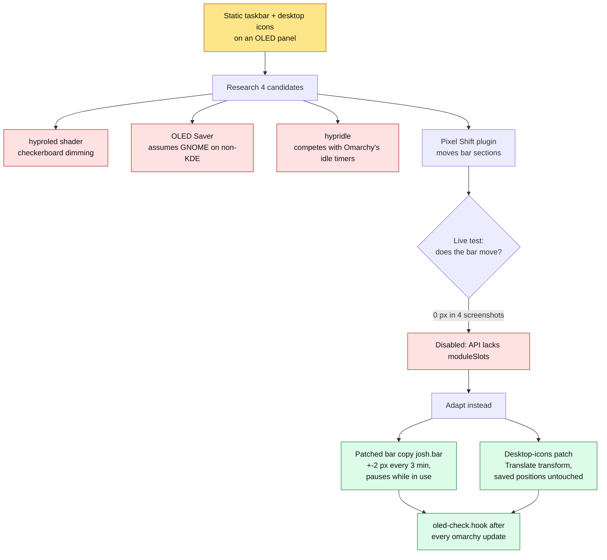
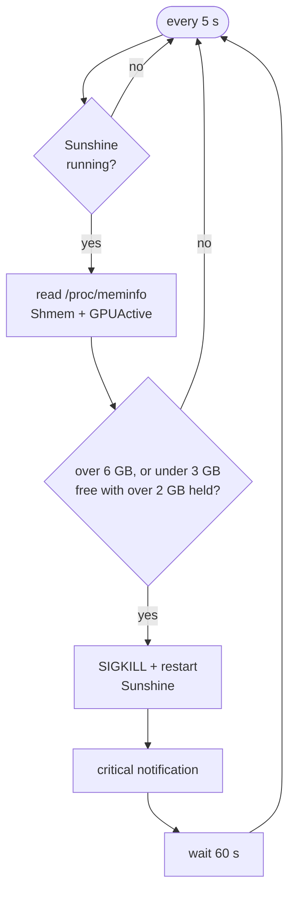

# Highlights, history, and architecture notes

The longer companion to the [README](../README.md): how the records fit
together, the setup timeline, the most interesting problems solved (with
their diagrams), and the full repository layout.

## How the records fit together

Each record has one job, and they link to each other rather than repeat.




Not every request ends in "done". The Fluent GTK theme and the Selawik font
were applied and later **reverted** (not noticeable; colour fringing on the
OLED); KDE Open/Save dialogs and a tray-overflow plugin were **declined**
after research (57 Plasma packages; unsupported internals); the Start-menu
fix was **done** once Josh confirmed it. At the time of the v1 snapshot, 60
items in [REQUESTS.md](../REQUESTS.md) are checked and 7 are open.

## Timeline

Dates are from [CHANGELOG.md](../CHANGELOG.md) and the topic logs.




## Problems solved

The more interesting problems, each with a link to its full write-up in the setup notes.

### OLED burn-in: when the obvious plugin silently does nothing

The taskbar and desktop icons never move, which is the worst case for an OLED
panel. The research compared four options; the best-matched community plugin
loaded, passed its own tests, and moved nothing. The cause: Omarchy's
restricted plugin API doesn't expose the `moduleSlots` property the plugin
relies on, so it returns without an error.



Movement was measured, not assumed: the clock stepped 1679 → 1681 → 1683 px
in the running bar, and the desktop-position file kept the same SHA-256 while
icons moved. The hook compares the packaged `Bar.qml` with the hash the patch
was made against, so an Omarchy update that changes the bar raises a
notification instead of silently dropping the protection.
[OLED.md](../setup/OLED.md) ·
[research](../setup/OLED-RESEARCH.md) ·
[trial](../setup/OLED-PIXEL-SHIFT-TRIAL.md)


### A fan that never stopped

The fan ran constantly. An orphaned `lua` process had been at 100% CPU for
19 hours, holding the package at 86 °C. Omarchy's keybindings menu (Win+K)
evaluates `hyprland.lua` in a stub environment where every `hl.*` call
returns a placeholder, so an `ipairs()` loop over `hl.get_loaded_plugins()`
in `windows_style.lua` never ended. The loop is now counted, the process was
killed (about 45 °C afterwards), and the on-charger power profile moved from
Performance to Balanced.
[MACHINE.md](../MACHINE.md#2026-09-23--omarchy--quieter-fan-balanced-on-ac-claude) ·
[WINDOWS-AND-SHORTCUTS.md](../setup/windows-style/WINDOWS-AND-SHORTCUTS.md#keep-this-file-safe-for-omarchys-keybindings-menu)

### The hollow cursor: four causes of lost keyboard focus

Typing would stop in a window that still looked focused. A Hyprland event
logger showed four separate causes: invisible shell panels opened by
another agent's tests, click-to-focus not returning the keyboard after a
pop-up closed, the screensaver dismissal landing on the desktop layer, and
the desktop-icons layer grabbing the keyboard on every wallpaper click. The
fixes are a delayed re-focus handler, a screensaver launcher that restores
the previous window, and a plugin patch; a 15-round test delivered every
typed marker. [TROUBLESHOOTING.md](../setup/windows-style/TROUBLESHOOTING.md)

### A remote-desktop host that ate all memory

Sunshine was left streaming on the lock screen. Graphics buffers grew by
about one 2880×1800 frame per second until the kernel OOM killer took five
apps. No process's memory accounted for it; the kernel's `shmem` and
`gpu_active` counters did. A small user service now restarts Sunshine when
those buffers pass 6 GB. The same day, a Sunshine security advisory was
fixed by installing the signed build from Omarchy's edge repo, after
checking its signature and hash.



[sunshine/README.md](../setup/sunshine/README.md) ·
[sunshine-memguard.sh](../setup/sunshine/sunshine-memguard.sh)

### More

- **Start menu with empty grid, then apps that never launched:** Omarchy
  4.0.4 only hands its app library to one kind of plugin, so the launcher now
  falls back to its own instance; separately, `dismiss()` destroyed that
  instance before `launch()` ran. [PLUGINS.md](../setup/windows-style/PLUGINS.md#start-menu-with-coloured-icons) ·
  [fix](../setup/start-menu-launch-fix/README.md)
- **Windows-style maximize:** Hyprland draws maximized windows beneath
  floating ones, so maximize is rewritten as a floating window filling the
  work area. [WINDOWS-AND-SHORTCUTS.md](../setup/windows-style/WINDOWS-AND-SHORTCUTS.md#window-behaviour)
- **Slow NAS browsing:** each `.local` lookup waited 5 s for an IPv6 mDNS
  answer; `mdns4_minimal` brought it to 0.07 s, and kernel CIFS automounts
  replaced Dolphin's user-space SMB client. [NAS.md](../setup/windows-style/NAS.md)
- **Live dictation:** voxtype switched to streaming Parakeet; the daemon
  crash-looped until the context windows were set to multiples of 0.08 s,
  values found in the error text and the binary, not the docs.
  [DICTATION.md](../setup/windows-style/DICTATION.md)
- **Supply-chain care:** every shell plugin's source was read before
  install and pinned to the reviewed commit in
  [plugins.txt](../setup/windows-style/plugins.txt); AUR PKGBUILDs were read
  and built as the user; release signatures were checked. Trade-offs that
  loosen security (agents running without approval prompts, mise's
  release-age delay turned off) are recorded as deliberate, with undo steps.
- **The audit:** on the last day Claude compared every Claude and Codex
  session with the repo, found two undocumented Codex changes (now
  recorded) and a repeat script that skipped the OLED and Start-menu
  patches (now fixed).
  [CHANGELOG.md](../CHANGELOG.md)

## Repository layout

```text
omarchy-setup/
├── AGENTS.md            working agreement for all agents
├── REQUESTS.md          requests and their status
├── CHANGELOG.md         dated summary of every change
├── MACHINE.md           machine-level changes + repeat procedure
├── CLAUDE.md            Claude Code log
├── CODEX.md             Codex log
├── docs/                this file + the README image
└── setup/
    ├── windows-style/   desktop: windows_style.lua, install.sh, patches, topic docs
    │   ├── colors/ dictation/ dolphin/ flameshot/ screensaver/ theme-overlay/ apps/
    ├── OLED.md  OLED-RESEARCH.md  OLED-PIXEL-SHIFT-TRIAL.md  oled-check.hook
    ├── oled-bar-proposal/     bar-pixel-shift.patch + base hash
    ├── oled-desktop-icons/    desktop-icons-oled.patch + verification
    ├── start-menu-launch-fix/ launch-before-dismiss.patch
    ├── omapanel/        taskbar settings + configure.py
    ├── sunshine/        memory guard, firewall rules, leak test
    ├── apps/  browsers/  desktop-apps/  ai-clis/  messaging/  network-apps/
    ├── ghostty/  claude/
    ├── plasma/          the abandoned Plasma route, for the record
    └── DECISION-OMARCHY-VS-ARCH.md  OMARCHY-PLUGINS.md
```
